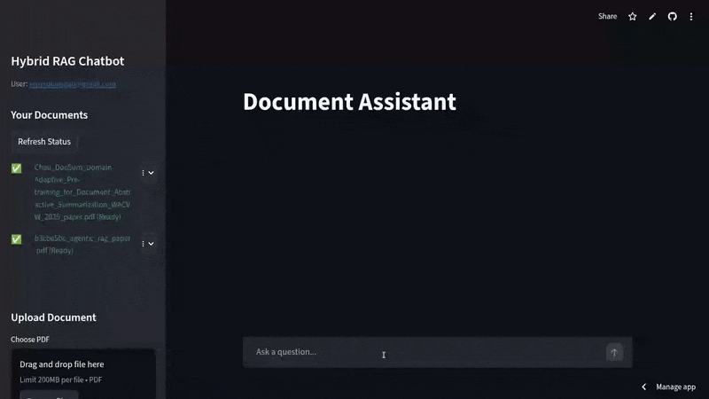
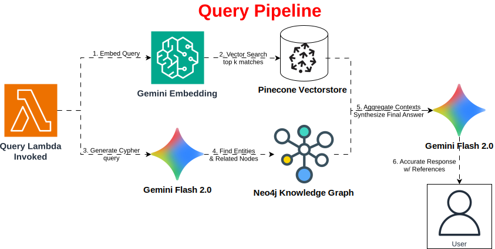

# RAG-on-AWS

Fully End-to-End serverless hybrid Retrieval-Augmented Generation (RAG) application designed to run on AWS, provisioned via IaC (Terraform). The system ingests PDF documents into two knowledge stores (a vector database (Pinecone) for dense retrieval and a knowledge graph (Neo4j) for structured facts), then synthesizes answers using Google GenAI (Gemini) via Amazon Lambda. 

To ensure reliability, the pipeline features an automated 'LLM-as-a-Judge' evaluation suite (DeepEval) integrated into a CI/CD workflow, verifying answer faithfulness and relevancy before every deployment."


## Tech Stack

* **Frontend:**
    

* **Backend:** 
    ![AWS Lambda][Lambda-logo]
    ![ECR][ECR-logo]
    


* **Authentication:** 

* **File Storage**: ![Amazon S3][S3-logo]

* **Vector Database:** ![Pinecone][Pinecone-logo]

* **Graph Database:** 

* **Chat & Embedding Models:**
    

* **Source Control:**
    
    

* **Infrastructure & CI/CD:**
    
    

## Demo

[](https://tmdeptrai-rag-on-aws.streamlit.app/)



## Table of contents
- [Project Overview](#project-overview)
- [How it works: Implementation details](#how-it-works-implementation-details)
- [RAG Evaluation & Testing](#evaluation--testing)
- [Quickstart: Local development](#quickstart-local-development)
- [Run backend components locally (ingest & query)](#run-backend-components-locally)
- [Docker: Build the Lambda-compatible artifacts](#docker-build-the-lambda-compatible-artifacts)
- [Infrastructure as Code](#infrastructure-as-code-iac)
- [Deploying to AWS](#deploying-to-aws)
- [Configuration: Environment variables & Streamlit secrets](#configuration-environment-variables--streamlit-secrets)
- [Troubleshooting & diagnostics](#troubleshooting--diagnostics)
- [Security best practices](#security-best-practices)
- [Contributing](#contributing)
- [Userful Commands](#useful-commands-summary)
- [License](#license)

---

## Project Overview

This repository contains:
- frontend: Streamlit app (frontend/app.py) and helper clients
- backend/ingest: Lambda-style service to parse PDFs, create embeddings, and persist vectors & graph triples
- backend/query: Lambda-style service to perform hybrid retrieval (vector + Neo4j), then call an LLM for answer generation
- Dockerfiles for producing Lambda-ready runtimes
- Deploy scripts: scripts/deploy_all.sh, scripts/deploy_query.sh, scripts/deploy_ingest.sh
- Example environment variables: .env.example

Primary external services:
- AWS S3: document storage and trigger for ingestion
- AWS Cognito: user authentication for the front-end
- Pinecone: dense vector index for semantic retrieval
- Neo4j: knowledge graph for extracted triples and structured relationships
- Google GenAI (Gemini): embeddings and LLMs

Project Structure:
```text
RAGwithAWS/
├── backend/                            
│   ├── ingest/                         # Ingest Lambda
│   │   ├── ingest.py
│   │   ├── ingest_requirements.txt
│   │   └── Dockerfile
│   └── query/                          # Query Lambda
│       ├── query.py
│       ├── query_requirements.txt
│       └── Dockerfile
├── frontend/                           # Streamlit frontend
│   ├── app.py                          # Landing page
│   ├── auth_client.py                  # Authentication
│   ├── chat_api.py                     # API call to query handler
│   ├── files_handler.py                # S3 file upload/delete
│   └── requirements.txt
├── infrastructure/                     # Infrastructure as Code
│   ├── modules/                        # Modules (backend, auth, etc.)
│   ├── main.tf                         # Entry point
│   ├── variables.tf                    # Configuration definitions
│   └── outputs.tf                      # Output endpoints
├── scripts/                            # Automation scripts (local)
│   ├── deploy_all.sh
│   ├── deploy_ingest.sh
│   └── deploy_query.sh
├── tests/                              # RAG Evaluation
│   ├── test_rag.py                     # DeepEval test suite
│   └── golden_dataset.json             # QA pairs for eval
├── .env.example 
├── .gitignore 
├── LICENSE
└── README.md
```

---

## How it works: Implementation details

<!-- DIAGRAM: Ingest Pipeline Flow -->


Ingest pipeline (backend/ingest/ingest.py):
- Text extraction: pymupdf loads the PDF and extracts page text.
- Clean-up: `clean_scanned_text` applies regex fixes for hyphenated line breaks and surplus whitespace.
- Chunking: `recursive_split` splits into chunks (~1000 chars default with 100 overlap) using smart split heuristics (prefer periods/spaces).
- Embeddings: Sends batches of chunks to Google GenAI embedding model `gemini-embedding-001` via genai client.
- Pinecone upsert: Upserts vectors in batches of 50 into Pinecone index, using user email as namespace.
- Graph extraction: Generates a dense summary (Gemini), then extracts knowledge triples using a JSON schema. Converts triples into sanitized relationship types and persists them in Neo4j (MERGE semantics).
- Status updates: Tags the S3 object with status (`indexing`, `ready`, `failed`) via `put_object_tagging`.

<!-- DIAGRAM: Query Pipeline Flow -->


Query pipeline (backend/query/query.py):
- Embedding query: Uses GenAI to embed the user's question.
- Vector search: Queries Pinecone namespace (user space) for top_k matches (k=4), returns metadata text.
- Graph search: Uses Gemini to generate a Cypher query (the LLM writes the Cypher to find entities and related nodes).
- Aggregation: Combines vector and graph results into a context block, then calls Gemini to synthesize a final answer using a system instruction that forces it to use only the provided context.
- Response: Returns answer and references (vector chunks and graph facts).

<!-- DIAGRAM: Frontend User Flow -->

Frontend (Streamlit):
- Login/Registration using Cognito via frontend/auth_client.py.
- Uploads stored into S3 (per-user folder).
- Polling: The frontend polls S3 object tags to wait for ingestion completion (helper functions implemented in frontend/files_handler.py).
- Query: The frontend calls an endpoint (QUERY_LAMBDA_URL) to get answer and references. The UI displays answer and the cited contexts.

---

## RAG Evaluation & Testing

Reliability is ensured through an automated "LLM-as-a-Judge" evaluation pipeline using **DeepEval**. Every code change triggers a regression test suite that validates the RAG pipeline against a "Golden Dataset" of Q&A pairs.

**Metrics Tracked:**
- **Faithfulness:** Does the answer come purely from the retrieved context?
- **Answer Relevancy:** Does the answer actually address the user's prompt?
- **Contextual Precision:** Are the retrieved chunks relevant to the query?

**Run Tests Locally:**
```bash
# Run the full test suite and generate an HTML report
pytest tests/test_rag.py --html=report.html
```

## Quickstart: Local development

Prerequisites:
- Python 3.11 (recommended)
- pip
- Docker (for building runtime images)
- AWS CLI configured with credentials (if deploying to AWS)
- Accounts & credentials for: Pinecone, Neo4j (Aura or hosted), Google Cloud API (GenAI access), AWS (S3, Cognito, Lambda), and Pinecone.

1. Clone repository
   ```bash
   git clone https://github.com/tmdeptrai/rag-on-aws.git
   cd rag-on-aws
   ```

2. Copy `.env.example` to `.env` and fill in credentials OR set secrets as described below
   ```bash
   cp .env.example .env
   # Edit .env with real values
   ```

3. Install frontend dependencies and run Streamlit
   ```bash
   python -m pip install -r frontend/requirements.txt
   # Streamlit will read st.secrets via .streamlit/secrets.toml (see Configuration below)
   streamlit run frontend/app.py
   ```

4. Configure Streamlit secrets (recommended for local dev or prod — see Configuration section)

5. Use the UI to sign-up/login and upload a PDF. The upload will place the file into S3 using AWS credentials available in st.secrets. If the ingestion lambda is not deployed in AWS, you can simulate local ingestion (see Run backend components locally).

---

## Run backend components locally

Each backend module (ingest/query) contains a local test mode when executed directly. These are convenient for development and debugging.

Notes:
- The backend modules use python-dotenv to load `.env`.
- They assume remote services (Pinecone, Neo4j, Google GenAI) are reachable.

Run local ingest test:
```bash
python backend/ingest/ingest.py
```
This runs a small built-in test_event that points to the S3 bucket configured in `.env`. It will attempt to download the example file key from your S3 bucket. Update `.env` with valid S3 bucket name and credentials.

Run local query test:
```bash
python backend/query/query.py
```
This runs the built-in query test and requires Pinecone, Neo4j, and GenAI credentials.

If you want to test ingestion end-to-end without Lambda:
- Upload a PDF to your S3 bucket under the same key pattern expected by ingest.py (example: `documents/<user_email>/<filename>.pdf`) and then run ingest.py locally pointing to that key by adjusting the test_event in the file or invoking `lambda_handler` with a constructed event.

---

## Docker: Build the Lambda-compatible artifacts

The repository includes two Dockerfiles (backend/ingest/Dockerfile and backend/query/Dockerfile). These produce a runtime with dependencies installed into `/usr/local/lib/python3.11/site-packages` and copy the handler as `lambda_function.py` so the awslambdaric entrypoint can run the Lambda handler.

Build the ingest image (for local testing or to inspect collector contents):
```bash
docker build -t rag-ingest -f backend/ingest/Dockerfile .
```

Build the query image:
```bash
docker build -t rag-query -f backend/query/Dockerfile .
```

Note: These Dockerfiles are intended to create runtime packages for AWS Lambda. If you intend to deploy as Lambda functions with a container image, follow AWS Lambda container guidelines and push the built images to ECR, then create/update Lambda functions pointing at the ECR images. The provided Dockerfiles include awslambdaric so they are Lambda-compatible.

---

## Infrastructure as Code (IaC)

All AWS resources (Lambdas, S3, Cognito, IAM Roles, ECR) are defined in **Terraform**. This ensures zero configuration drift between development and production environments.

**Reasons:**
- **State Management:** Terraform state is stored securely in S3 to allow team collaboration.
- **Modular Design:** Infrastructure is split into reusable modules (`modules/`).
- **Zero-Downtime Updates:** Lambda functions are updated in-place without breaking service.

**Deploying Manually (from local):**
```bash
cd infrastructure
# Initialize Terraform and backend
terraform init

# Plan and Apply changes
terraform plan -out=tf.plan
terraform apply tf.plan
```

---

## Deploying to AWS

### Option A: Automated CI/CD (Recommended)
This repository uses a **GitHub Actions** pipeline that fully automates the release process:

1. **Push to `main`**: Triggers the **RAG Evaluation Pipeline**.
2. **Test**: Runs `pytest` with DeepEval. If accuracy metrics drop below the threshold (e.g., 0.7), the pipeline fails.
3. **Deploy**: If tests pass, the **Deploy Workflow** triggers:
   - Builds Docker images for `ingest` and `query` services.
   - Pushes images to Amazon ECR with the specific Git SHA tag.
   - Runs `terraform apply` to update the Lambda functions to use the new images.
   - Syncs the Streamlit frontend code to the production branch.

### Option B: Manual Deployment
See the [Infrastructure as Code](#infrastructure-as-code-iac) section above to deploy using Terraform locally.

---

## Configuration: Environment variables & Streamlit secrets

The repository contains `.env.example`. Below is the authoritative mapping. For local backend runs, the `.env` file is used by python-dotenv. For the Streamlit frontend, use `.streamlit/secrets.toml` or set environment variables in your hosting platform.

.env / st.secrets mapping (descriptions):

- AWS CONFIG
  - REGION_NAME / AWS_REGION: AWS region (e.g., us-east-1)
  - AWS_ACCESS_KEY_ID: AWS access key (do not commit)
  - AWS_SECRET_ACCESS_KEY: AWS secret key (do not commit)
  - S3_BUCKET_NAME: Bucket used for uploading documents and status tagging
  - COGNITO_USER_POOL_ID: Cognito user pool id for authentication
  - COGNITO_APP_CLIENT_ID: Cognito App Client ID for auth flows

- DATABASES
  - PINECONE_API_KEY: API key for Pinecone
  - PINECONE_INDEX_NAME: Pinecone index name used by the app
  - NEO4J_URI: Bolt or neo4j+s URL for Neo4j (e.g., neo4j+s://<host>)
  - NEO4J_USERNAME: Neo4j username
  - NEO4J_PASSWORD: Neo4j password
  - NEO4J_DATABASE: Optional target database name
  - AURA_INSTANCEID / AURA_INSTANCENAME: optional Aura fields

- AI MODEL (Google Gemini)
  - GOOGLE_API_KEY: Google API key for GenAI (Gemini) access

- FRONTEND / LAMBDA ENDPOINTS
  - QUERY_LAMBDA_URL: URL for query Lambda (API Gateway or Lambda Function URL)

Streamlit secrets example (`.streamlit/secrets.toml`):
```toml
AWS_REGION = "us-east-1"
AWS_ACCESS_KEY_ID = "AKIA..."
AWS_SECRET_ACCESS_KEY = "..."
S3_BUCKET_NAME = "your-rag-project-storage"
COGNITO_APP_CLIENT_ID = "..."
COGNITO_USER_POOL_ID = "..."
QUERY_LAMBDA_URL = "https://your-api-gateway-or-lambda-url"
PINECONE_API_KEY = "..."
PINECONE_INDEX_NAME = "..."
NEO4J_URI = "neo4j+s://..."
NEO4J_USERNAME = "..."
NEO4J_PASSWORD = "..."
GOOGLE_API_KEY = "..."
```

Important: Do not commit `.env` or `.streamlit/secrets.toml` to source control. Use secret storage (AWS Secrets Manager, Parameter Store, or CI/CD secret storage) for production.

---

## Sample API request

If you have a query endpoint URL (`QUERY_LAMBDA_URL`), you can test it with curl:

```bash
curl -X POST $QUERY_LAMBDA_URL \
  -H "Content-Type: application/json" \
  -d '{
    "question": "Who is Thomas Jefferson?",
    "user_email": "alice@example.com"
  }'
```

Successful response: JSON with `answer` and `references` (array of vector and graph results).

---

## Troubleshooting & diagnostics

Common problems and how to diagnose them:

- Authentication/permissions errors:
  - Errors when uploading to S3 from the frontend: verify `AWS_ACCESS_KEY_ID` / `AWS_SECRET_ACCESS_KEY` in Streamlit secrets and ensure the IAM user has PutObject/GetObject/PutObjectTagging permissions for the S3 bucket.
  - Cognito sign-up / login errors: ensure the Cognito App Client ID and User Pool ID are correct and the app client authorizes USER_PASSWORD_AUTH if used.

- Pinecone / Neo4j connectivity:
  - Connection or timeout errors: confirm API keys, index names, and host URLs; check network egress and VPC settings (Lambda within private subnets must have NAT to reach external services).
  - Empty search results: ensure ingestion succeeded and vectors have been upserted to the expected namespace (user email). Check upsert logs in ingest Lambda.

- Google GenAI failures:
  - API key invalid or quota exceeded. Check the project associated with the key. Enable GenAI APIs where required.

- Memory or timeouts in Lambda:
  - Large PDFs can increase memory and runtime. Consider increasing Lambda memory/time or pre-chunking files.

- Debugging logs:
  - For Lambda: use CloudWatch logs. Look for prints and caught exceptions in ingest.py and query.py.
  - For local runs: the console prints details; run the backend Python files directly to see test outputs.

- S3 object tags used for ingestion status are critical to the frontend polling flow. If tags are not being updated, verify `s3:PutObjectTagging` permission for the ingest role.

---

## Security best practices

- Never commit secrets to Git. Use `.gitignore` (this repo has one) and secure secret storage (AWS Secrets Manager, Parameter Store, or CI/CD secret vaults).
- Least privilege IAM: grant only the permissions each service needs (S3 bucket access, Lambda execute, CloudWatch logs, etc.).
- Network controls: if Neo4j is hosted in a private network, deploy Lambdas inside a VPC with appropriate subnets and NAT gateway.
- Rotate and audit API keys regularly (Pinecone, Google GenAI, Neo4j).
- Input sanitization: the repo uses LLM-generated Cypher queries. In production, review and sanitize generated Cypher before executing or tightly constrain model prompts/response format.

---

## Contributing

- Please open issues and pull requests for bug fixes, features, or documentation improvements.
- Contributor workflow:
  1. Fork repository.
  2. Create a feature branch.
  3. Implement and test changes.
  4. Open a PR with a clear description and testing notes.

Before opening PRs that modify deployment scripts, coordinate to avoid interfering with shared resources.

---

## Useful commands summary

Install requirements:
- Frontend:
  ```bash
  python -m pip install -r frontend/requirements.txt
  ```
- Ingest:
  ```bash
  python -m pip install -r backend/ingest/ingest_requirements.txt
  ```
- Query:
  ```bash
  python -m pip install -r backend/query/query-requirements.txt
  ```

Run Streamlit:
```bash
streamlit run frontend/app.py
```

Run local backend tests:
```bash
python backend/ingest/ingest.py
python backend/query/query.py
```

Build Docker images:
```bash
docker build -t rag-ingest -f backend/ingest/Dockerfile .
docker build -t rag-query -f backend/query/Dockerfile .
```

Deploy scripts:
```bash
# Ensure executable
chmod +x scripts/*.sh
./scripts/deploy_all.sh
```

---

## License

This project is licensed under the Apache License 2.0. See the [LICENSE](LICENSE) file for details.

<!-- Logos and Icons -->

[ECR-logo]:https://img.shields.io/badge/ECR-27272A?logo=data:image/svg+xml;base64,PD94bWwgdmVyc2lvbj0iMS4wIiBlbmNvZGluZz0iVVRGLTgiPz4KPHN2ZyB3aWR0aD0iODBweCIgaGVpZ2h0PSI4MHB4IiB2aWV3Qm94PSIwIDAgODAgODAiIHZlcnNpb249IjEuMSIgeG1sbnM9Imh0dHA6Ly93d3cudzMub3JnLzIwMDAvc3ZnIiB4bWxuczp4bGluaz0iaHR0cDovL3d3dy53My5vcmcvMTk5OS94bGluayI+CiAgICA8IS0tIEdlbmVyYXRvcjogU2tldGNoIDY0ICg5MzUzNykgLSBodHRwczovL3NrZXRjaC5jb20gLS0+CiAgICA8dGl0bGU+SWNvbi1BcmNoaXRlY3R1cmUvNjQvQXJjaF9BbWF6b24tRWxhc3RpYy1Db250YWluZXItUmVnaXN0cnlfNjQ8L3RpdGxlPgogICAgPGRlc2M+Q3JlYXRlZCB3aXRoIFNrZXRjaC48L2Rlc2M+CiAgICA8ZGVmcz4KICAgICAgICA8bGluZWFyR3JhZGllbnQgeDE9IjAlIiB5MT0iMTAwJSIgeDI9IjEwMCUiIHkyPSIwJSIgaWQ9ImxpbmVhckdyYWRpZW50LTEiPgogICAgICAgICAgICA8c3RvcCBzdG9wLWNvbG9yPSIjQzg1MTFCIiBvZmZzZXQ9IjAlIj48L3N0b3A+CiAgICAgICAgICAgIDxzdG9wIHN0b3AtY29sb3I9IiNGRjk5MDAiIG9mZnNldD0iMTAwJSI+PC9zdG9wPgogICAgICAgIDwvbGluZWFyR3JhZGllbnQ+CiAgICA8L2RlZnM+CiAgICA8ZyBpZD0iSWNvbi1BcmNoaXRlY3R1cmUvNjQvQXJjaF9BbWF6b24tRWxhc3RpYy1Db250YWluZXItUmVnaXN0cnlfNjQiIHN0cm9rZT0ibm9uZSIgc3Ryb2tlLXdpZHRoPSIxIiBmaWxsPSJub25lIiBmaWxsLXJ1bGU9ImV2ZW5vZGQiPgogICAgICAgIDxnIGlkPSJJY29uLUFyY2hpdGVjdHVyZS1CRy82NC9Db250YWluZXJzIiBmaWxsPSJ1cmwoI2xpbmVhckdyYWRpZW50LTEpIj4KICAgICAgICAgICAgPHJlY3QgaWQ9IlJlY3RhbmdsZSIgeD0iMCIgeT0iMCIgd2lkdGg9IjgwIiBoZWlnaHQ9IjgwIj48L3JlY3Q+CiAgICAgICAgPC9nPgogICAgICAgIDxwYXRoIGQ9Ik0zOC43ODgwNzQxLDM3LjU3NzY5NDUgQzM4LjI5MzM4NDUsMzcuODY1NTEyNSAzNy45ODU1Nzc3LDM4LjQwMDAzMTcgMzcuOTg1NTc3NywzOC45NzM2NjIgTDM3Ljk4NTU3NzcsNjYuNzE5NTE4NiBMMTYuOTk4NzQ1OSw1NC45ODQxNjU1IEwxNi45OTg3NDU5LDI3LjcwNzY0MjggTDQwLjU1Njk2NDMsMTQuMDU4ODUxNSBMNjEuNDg0ODMzLDI0LjQyODMyMjYgTDM4Ljc4ODA3NDEsMzcuNTc3Njk0NSBaIE02My45MjAzMDQ5LDI0LjQwMjI0ODUgQzYzLjkyMDMwNDksMjMuODI3NjE1MyA2My42MTM0OTc0LDIzLjI5MjA5MzMgNjMuMDU5ODQ0OCwyMi45NzUxOTI3IEw0MS4zNDY0Njg5LDEyLjIxNDYwOTkgQzQwLjg1MDc3OTksMTEuOTI4Nzk3NiA0MC4yMzUxNjYyLDExLjkyNzc5NDggMzkuNzQwNDc2NiwxMi4yMTU2MTI4IEwxNS44MDI0OTY1LDI2LjA4NDAyODMgQzE1LjMwNzgwNjksMjYuMzcxODQ2MyAxNSwyNi45MDYzNjU1IDE1LDI3LjQ3OTk5NTggTDE1LDU1LjIxNTgyMzkgQzE1LDU1Ljc4OTQ1NDIgMTUuMzA3ODA2OSw1Ni4zMjM5NzM0IDE1LjgxNzQ4NzEsNTYuNjE5ODE0MiBMMzcuNTczODM2LDY4Ljc4NTM5MDEgQzM3LjgyMTY4MDUsNjguOTI4Nzk3NiAzOC4xMDA1MDU2LDY5IDM4LjM3ODMzMTIsNjkgQzM4LjY1NTE1NzUsNjkgMzguOTMzOTgyNiw2OC45Mjg3OTc2IDM5LjE4MDgyNzcsNjguNzg1MzkwMSBDMzkuNjc2NTE2Nyw2OC40OTg1NzQ5IDM5Ljk4NDMyMzYsNjcuOTY0MDU1NyAzOS45ODQzMjM2LDY3LjM4OTQyMjYgTDM5Ljk4NDMyMzYsMzkuMjAxMzA5IEw2My4xMTc4MDg0LDI1Ljc5ODIxNiBDNjMuNjEzNDk3NCwyNS41MTE0MDA4IDYzLjkyMDMwNDksMjQuOTc2ODgxNyA2My45MjAzMDQ5LDI0LjQwMjI0ODUgTDYzLjkyMDMwNDksMjQuNDAyMjQ4NSBaIE02My45NjkyNzQyLDU1LjA0NzM0NTEgTDQ0Ljk4MTE4ODMsNjYuNjYxMzUzMyBMNDQuOTgxMTg4Myw1Ni4yNjE3OTY3IEw1NC44ODE5NzYsNDkuODcyNjM4IEw1NC45NDk5MzM0LDQ5LjQyNDM2NCBDNTQuOTY3OTIyMSw0OS4zMDcwMzA1IDU0Ljk3NDkxNzcsNDkuMzA3MDMwNSA1NC45NzQ5MTc3LDQ4Ljc2NjQ5NDIgTDU1LjAwNTg5ODMsMzYuMzYwMjM0NCBMNjQuMDAwMjU0NywzMS4xNDg0MjE4IEw2My45NjkyNzQyLDU1LjA0NzM0NTEgWiBNNjUuMTk2NTA0MiwyOS4wNzE1MTkxIEM2NC42OTk4MTU4LDI4Ljc4MTY5NTMgNjQuMDg0MjAyMSwyOC43ODI2OTgyIDYzLjU4ODUxMzEsMjkuMDcxNTE5MSBMNTQuMDEzNTIwOSwzNC42MTgyODM1IEM1My43MTM3MDksMzQuNzgxNzQ4MSA1My4wMDgxNTE3LDM1LjE2NTgzOTggNTMuMDA4MTUxNywzNS45NTgwOTE0IEw1Mi45NzYxNzE4LDQ4LjcxNzM1NDYgTDQzLjg1MDg5NzUsNTQuNjA2MDkxIEM0My4zMDYyMzkyLDU0LjkzMTAxNDUgNDIuOTgyNDQyNCw1NS40NDU0NzY2IDQyLjk4MjQ0MjQsNTUuOTg5MDIxNCBMNDIuOTgyNDQyNCw2Ny4zMDgxOTE3IEM0Mi45ODI0NDI0LDY3Ljg3NDgwMjEgNDMuMjg3MjUxMSw2OC4zOTEyNjk5IDQzLjc5NzkzMDcsNjguNjg3MTEwNyBDNDQuMDY0NzYzMyw2OC44NDA1NDY4IDQ0LjM2MTU3Nyw2OC45MTg3NjkxIDQ0LjY1NzM5MTQsNjguOTE4NzY5MSBDNDQuOTQ4MjA5LDY4LjkxODc2OTEgNDUuMjM5MDI2NSw2OC44NDQ1NTgyIDQ1LjUwMTg2MTYsNjguNjkyMTI1IEw2NS4xNjc1MjIzLDU2LjY2MzkzOTYgQzY1LjY2MjIxMTksNTYuMzc2MTIxNiA2NS45NjgwMjAxLDU1Ljg0MTYwMjQgNjUuOTY4MDIwMSw1NS4yNzA5ODA3IEw2NiwzMC40NjY0ODM3IEM2NiwyOS44OTI4NTM0IDY1LjY5MjE5MzEsMjkuMzU4MzM0MiA2NS4xOTY1MDQyLDI5LjA3MTUxOTEgTDY1LjE5NjUwNDIsMjkuMDcxNTE5MSBaIiBpZD0iQW1hem9uLUVsYXN0aWMtQ29udGFpbmVyLVJlZ2lzdHJ5X0ljb25fNjRfU3F1aWQiIGZpbGw9IiNGRkZGRkYiPjwvcGF0aD4KICAgIDwvZz4KPC9zdmc+

[Lambda-logo]:https://img.shields.io/badge/Lambda-27272A?logo=data:image/svg+xml;base64,PD94bWwgdmVyc2lvbj0iMS4wIiBlbmNvZGluZz0iVVRGLTgiPz4KPHN2ZyB3aWR0aD0iODBweCIgaGVpZ2h0PSI4MHB4IiB2aWV3Qm94PSIwIDAgODAgODAiIHZlcnNpb249IjEuMSIgeG1sbnM9Imh0dHA6Ly93d3cudzMub3JnLzIwMDAvc3ZnIiB4bWxuczp4bGluaz0iaHR0cDovL3d3dy53My5vcmcvMTk5OS94bGluayI+CiAgICA8IS0tIEdlbmVyYXRvcjogU2tldGNoIDY0ICg5MzUzNykgLSBodHRwczovL3NrZXRjaC5jb20gLS0+CiAgICA8dGl0bGU+SWNvbi1BcmNoaXRlY3R1cmUvNjQvQXJjaF9BV1MtTGFtYmRhXzY0PC90aXRsZT4KICAgIDxkZXNjPkNyZWF0ZWQgd2l0aCBTa2V0Y2guPC9kZXNjPgogICAgPGRlZnM+CiAgICAgICAgPGxpbmVhckdyYWRpZW50IHgxPSIwJSIgeTE9IjEwMCUiIHgyPSIxMDAlIiB5Mj0iMCUiIGlkPSJsaW5lYXJHcmFkaWVudC0xIj4KICAgICAgICAgICAgPHN0b3Agc3RvcC1jb2xvcj0iI0M4NTExQiIgb2Zmc2V0PSIwJSI+PC9zdG9wPgogICAgICAgICAgICA8c3RvcCBzdG9wLWNvbG9yPSIjRkY5OTAwIiBvZmZzZXQ9IjEwMCUiPjwvc3RvcD4KICAgICAgICA8L2xpbmVhckdyYWRpZW50PgogICAgPC9kZWZzPgogICAgPGcgaWQ9Ikljb24tQXJjaGl0ZWN0dXJlLzY0L0FyY2hfQVdTLUxhbWJkYV82NCIgc3Ryb2tlPSJub25lIiBzdHJva2Utd2lkdGg9IjEiIGZpbGw9Im5vbmUiIGZpbGwtcnVsZT0iZXZlbm9kZCI+CiAgICAgICAgPGcgaWQ9Ikljb24tQXJjaGl0ZWN0dXJlLUJHLzY0L0NvbXB1dGUiIGZpbGw9InVybCgjbGluZWFyR3JhZGllbnQtMSkiPgogICAgICAgICAgICA8cmVjdCBpZD0iUmVjdGFuZ2xlIiB4PSIwIiB5PSIwIiB3aWR0aD0iODAiIGhlaWdodD0iODAiPjwvcmVjdD4KICAgICAgICA8L2c+CiAgICAgICAgPHBhdGggZD0iTTI4LjAwNzUzNTIsNjYgTDE1LjU5MDcyNzQsNjYgTDI5LjMyMzU4ODUsMzcuMjk2IEwzNS41NDYwMjQ5LDUwLjEwNiBMMjguMDA3NTM1Miw2NiBaIE0zMC4yMTk2Njc0LDM0LjU1MyBDMzAuMDUxMjc2OCwzNC4yMDggMjkuNzAwNDYyOSwzMy45ODkgMjkuMzE3NTc0NSwzMy45ODkgTDI5LjMxNDU2NzYsMzMuOTg5IEMyOC45Mjg2NzIzLDMzLjk5IDI4LjU3Nzg1ODMsMzQuMjExIDI4LjQxMjQ3NDYsMzQuNTU4IEwxMy4wOTc5NDQsNjYuNTY5IEMxMi45NDk1OTk5LDY2Ljg3OSAxMi45NzA2NDg3LDY3LjI0MyAxMy4xNTUwNzY2LDY3LjUzNCBDMTMuMzM3NDk5OCw2Ny44MjQgMTMuNjU4MjQzOSw2OCAxNC4wMDIwNDE2LDY4IEwyOC42NDIwMDcyLDY4IEMyOS4wMjk5MDcxLDY4IDI5LjM4MTcyMzQsNjcuNzc3IDI5LjU0ODEwOTQsNjcuNDI4IEwzNy41NjM3MDYsNTAuNTI4IEMzNy42OTMwMDYsNTAuMjU0IDM3LjY5MjAwMzcsNDkuOTM3IDM3LjU1ODY5NDQsNDkuNjY1IEwzMC4yMTk2Njc0LDM0LjU1MyBaIE02NC45OTUzNDkxLDY2IEw1Mi42NTg3Mjc0LDY2IEwzMi44NjY4MDksMjQuNTcgQzMyLjcwMTQyNTMsMjQuMjIyIDMyLjM0ODYwNjcsMjQgMzEuOTYxNzA5MSwyNCBMMjMuODg5OTgyMiwyNCBMMjMuODk5MDAzMSwxNCBMMzkuNzE5NzA4MSwxNCBMNTkuNDIwNDE0OSw1NS40MjkgQzU5LjU4NTc5ODYsNTUuNzc3IDU5LjkzODYxNzIsNTYgNjAuMzI1NTE0OCw1NiBMNjQuOTk1MzQ5MSw1NiBMNjQuOTk1MzQ5MSw2NiBaIE02NS45OTc2NzQ1LDU0IEw2MC45NTk5ODY4LDU0IEw0MS4yNTkyOCwxMi41NzEgQzQxLjA5Mzg5NjMsMTIuMjIzIDQwLjc0MTA3NzcsMTIgNDAuMzUzMTc3OCwxMiBMMjIuODk3NjgsMTIgQzIyLjM0NTM5ODcsMTIgMjEuODk2MzU2OSwxMi40NDcgMjEuODk1MzU0NSwxMi45OTkgTDIxLjg4NDMyOSwyNC45OTkgQzIxLjg4NDMyOSwyNS4yNjUgMjEuOTg4NTcwOCwyNS41MTkgMjIuMTc4MDEwMywyNS43MDcgQzIyLjM2NTQ0NTIsMjUuODk1IDIyLjYyMDAzNTgsMjYgMjIuODg2NjU0NCwyNiBMMzEuMzI5MjQxNywyNiBMNTEuMTIyMTYyNSw2Ny40MyBDNTEuMjg4NTQ4NSw2Ny43NzggNTEuNjM5MzYyNCw2OCA1Mi4wMjYyNiw2OCBMNjUuOTk3Njc0NSw2OCBDNjYuNTUxOTYwNSw2OCA2Nyw2Ny41NTIgNjcsNjcgTDY3LDU1IEM2Nyw1NC40NDggNjYuNTUxOTYwNSw1NCA2NS45OTc2NzQ1LDU0IEw2NS45OTc2NzQ1LDU0IFoiIGlkPSJBV1MtTGFtYmRhX0ljb25fNjRfU3F1aWQiIGZpbGw9IiNGRkZGRkYiPjwvcGF0aD4KICAgIDwvZz4KPC9zdmc+

[S3-logo]: https://img.shields.io/badge/S3-27272A?logo=data:image/svg+xml;base64,PD94bWwgdmVyc2lvbj0iMS4wIiBlbmNvZGluZz0iVVRGLTgiPz4KPHN2ZyB3aWR0aD0iODBweCIgaGVpZ2h0PSI4MHB4IiB2aWV3Qm94PSIwIDAgODAgODAiIHZlcnNpb249IjEuMSIgeG1sbnM9Imh0dHA6Ly93d3cudzMub3JnLzIwMDAvc3ZnIiB4bWxuczp4bGluaz0iaHR0cDovL3d3dy53My5vcmcvMTk5OS94bGluayI+CiAgICA8dGl0bGU+SWNvbi1BcmNoaXRlY3R1cmUvNjQvQXJjaF9BbWF6b24tU2ltcGxlLVN0b3JhZ2UtU2VydmljZV82NDwvdGl0bGU+CiAgICA8ZGVmcz4KICAgICAgICA8bGluZWFyR3JhZGllbnQgeDE9IjAlIiB5MT0iMTAwJSIgeDI9IjEwMCUiIHkyPSIwJSIgaWQ9ImxpbmVhckdyYWRpZW50LTEiPgogICAgICAgICAgICA8c3RvcCBzdG9wLWNvbG9yPSIjMUI2NjBGIiBvZmZzZXQ9IjAlIj48L3N0b3A+CiAgICAgICAgICAgIDxzdG9wIHN0b3AtY29sb3I9IiM2Q0FFM0UiIG9mZnNldD0iMTAwJSI+PC9zdG9wPgogICAgICAgIDwvbGluZWFyR3JhZGllbnQ+CiAgICA8L2RlZnM+CiAgICA8ZyBpZD0iSWNvbi1BcmNoaXRlY3R1cmUvNjQvQXJjaF9BbWF6b24tU2ltcGxlLVN0b3JhZ2UtU2VydmljZV82NCIgc3Ryb2tlPSJub25lIiBzdHJva2Utd2lkdGg9IjEiIGZpbGw9Im5vbmUiIGZpbGwtcnVsZT0iZXZlbm9kZCI+CiAgICAgICAgPGcgaWQ9IlJlY3RhbmdsZSIgZmlsbD0idXJsKCNsaW5lYXJHcmFkaWVudC0xKSI+CiAgICAgICAgICAgIDxyZWN0IHg9IjAiIHk9IjAiIHdpZHRoPSI4MCIgaGVpZ2h0PSI4MCI+PC9yZWN0PgogICAgICAgIDwvZz4KICAgICAgICA8ZyBpZD0iSWNvbi1TZXJ2aWNlLzY0L0FtYXpvbi1TaW1wbGUtU3RvcmFnZS1TZXJ2aWNlXzY0IiB0cmFuc2Zvcm09InRyYW5zbGF0ZSg4LjAwMDAwMCwgOC4wMDAwMDApIiBmaWxsPSIjRkZGRkZGIj4KICAgICAgICAgICAgPHBhdGggZD0iTTUyLjgzNTksMzQuODkyNiBMNTMuMjE5OSwzMi4xODg2IEM1Ni43NjA5LDM0LjMwOTYgNTYuODA2OSwzNS4xODU2IDU2LjgwNTkxMzIsMzUuMjA5NiBDNTYuNzk5OSwzNS4yMTQ2IDU2LjE5NTksMzUuNzE4NiA1Mi44MzU5LDM0Ljg5MjYgTDUyLjgzNTksMzQuODkyNiBaIE01MC44OTI5LDM0LjM1MjYgQzQ0Ljc3MjksMzIuNTAwNiAzNi4yNDk5LDI4LjU5MDYgMzIuODAwOSwyNi45NjA2IEMzMi44MDA5LDI2Ljk0NjYgMzIuODA0OSwyNi45MzM2IDMyLjgwNDksMjYuOTE5NiBDMzIuODA0OSwyNS41OTQ2IDMxLjcyNjksMjQuNTE2NiAzMC40MDA5LDI0LjUxNjYgQzI5LjA3NjksMjQuNTE2NiAyNy45OTg5LDI1LjU5NDYgMjcuOTk4OSwyNi45MTk2IEMyNy45OTg5LDI4LjI0NDYgMjkuMDc2OSwyOS4zMjI2IDMwLjQwMDksMjkuMzIyNiBDMzAuOTgyOSwyOS4zMjI2IDMxLjUxMDksMjkuMTA1NiAzMS45Mjc5LDI4Ljc2MDYgQzM1Ljk4NTksMzAuNjgxNiA0NC40NDI5LDM0LjUzNDYgNTAuNjA3OSwzNi4zNTQ2IEw0OC4xNjk5LDUzLjU2MDYgQzQ4LjE2MjksNTMuNjA3NiA0OC4xNTk5LDUzLjY1NDYgNDguMTU5OSw1My43MDE2IEM0OC4xNTk5LDU1LjIxNjYgNDEuNDUyOSw1Ny45OTk2IDMwLjQ5MzksNTcuOTk5NiBDMTkuNDE4OSw1Ny45OTk2IDEyLjY0MDksNTUuMjE2NiAxMi42NDA5LDUzLjcwMTYgQzEyLjY0MDksNTMuNjU1NiAxMi42Mzc5LDUzLjYxMDYgMTIuNjMxOSw1My41NjU2IEw3LjUzNzksMTYuMzU4NiBDMTEuOTQ2OSwxOS4zOTM2IDIxLjQyOTksMjAuOTk5NiAzMC40OTk5LDIwLjk5OTYgQzM5LjU1NTksMjAuOTk5NiA0OS4wMjI5LDE5LjM5OTYgNTMuNDQwOSwxNi4zNzM2IEw1MC44OTI5LDM0LjM1MjYgWiBNNi45OTk5LDEyLjQ3NzYgQzcuMDcxOSwxMS4xNjE2IDE0LjYzMzksNS45OTk2IDMwLjQ5OTksNS45OTk2IEM0Ni4zNjM5LDUuOTk5NiA1My45MjY5LDExLjE2MDYgNTMuOTk5OSwxMi40Nzc2IEw1My45OTk5LDEyLjkyNjYgQzUzLjEyOTksMTUuODc3NiA0My4zMjk5LDE4Ljk5OTYgMzAuNDk5OSwxOC45OTk2IEMxNy42NDc5LDE4Ljk5OTYgNy44NDI5LDE1Ljg2NzYgNi45OTk5LDEyLjkxMjYgTDYuOTk5OSwxMi40Nzc2IFogTTU1Ljk5OTksMTIuNDk5NiBDNTUuOTk5OSw5LjAzNDYgNDYuMDY1OSwzLjk5OTYgMzAuNDk5OSwzLjk5OTYgQzE0LjkzMzksMy45OTk2IDQuOTk5OSw5LjAzNDYgNC45OTk5LDEyLjQ5OTYgTDUuMDkzOSwxMy4yNTM2IEwxMC42NDE5LDUzLjc3NzYgQzEwLjc3NDksNTguMzA5NiAyMi44NjA5LDU5Ljk5OTYgMzAuNDkzOSw1OS45OTk2IEMzOS45NjU5LDU5Ljk5OTYgNTAuMDI4OSw1Ny44MjE2IDUwLjE1ODksNTMuNzgwNiBMNTIuNTU0OSwzNi44ODM2IEM1My44ODc5LDM3LjIwMjYgNTQuOTg0OSwzNy4zNjU2IDU1Ljg2NTksMzcuMzY1NiBDNTcuMDQ4OSwzNy4zNjU2IDU3Ljg0ODksMzcuMDc2NiA1OC4zMzM5LDM2LjQ5ODYgQzU4LjczMTksMzYuMDI0NiA1OC44ODM5LDM1LjQ1MDYgNTguNzY5OSwzNC44Mzk2IEM1OC41MTA5LDMzLjQ1NTYgNTYuODY3OSwzMS45NjM2IDUzLjUyMTksMzAuMDU0NiBMNTUuODk3OSwxMy4yOTI2IEw1NS45OTk5LDEyLjQ5OTYgWiIgaWQ9IkFtYXpvbi1TaW1wbGUtU3RvcmFnZS1TZXJ2aWNlLUljb25fNjRfU3F1aWQiPjwvcGF0aD4KICAgICAgICA8L2c+CiAgICA8L2c+Cjwvc3ZnPg==

[Pinecone-logo]: https://img.shields.io/badge/Pinecone-FFFFFF?logo=data:image/svg+xml;base64,PHN2ZyB4bWxucz0iaHR0cDovL3d3dy53My5vcmcvMjAwMC9zdmciIGZpbGw9Im5vbmUiIHZpZXdCb3g9IjAgMCAyNCAyNCIgaWQ9IlBpbmVjb25lLUljb24tLVN0cmVhbWxpbmUtU3ZnLUxvZ29zIiBoZWlnaHQ9IjI0IiB3aWR0aD0iMjQiPgogIDxkZXNjPgogICAgUGluZWNvbmUgSWNvbiBTdHJlYW1saW5lIEljb246IGh0dHBzOi8vc3RyZWFtbGluZWhxLmNvbQogIDwvZGVzYz4KICA8cGF0aCBmaWxsPSIjMjAxZDFlIiBkPSJNMTAuNDE1OTc1IDIxLjA2MDUyNWMwLjc0MjY3NSAwIDEuMzQ0NzUgMC42MDIwNSAxLjM0NDc1IDEuMzQ0NzI1IDAgMC43NDI3IC0wLjYwMjA3NSAxLjM0NDc1IC0xLjM0NDc1IDEuMzQ0NzUgLTAuNzQyNjc1IDAgLTEuMzQ0NzI1IC0wLjYwMjA1IC0xLjM0NDcyNSAtMS4zNDQ3NSAwIC0wLjc0MjY3NSAwLjYwMjA1IC0xLjM0NDcyNSAxLjM0NDcyNSAtMS4zNDQ3MjVabTcuNDYwNjI1IC0yLjQ1MzU1IDEuMzI4ODc1IDAuMzkzNzI1IC0xLjA1NDg1IDMuNTYwMTc1Yy0wLjA5MjE3NSAwLjMxMTEgLTAuMzg3ODUgMC41MTY1NzUgLTAuNzExNTUgMC40OTQ1MjVsLTAuMzI1ODI1IC0wLjAyMjM1IC0wLjAwNzk3NSAwLjAwNjU3NSAtMy4zODUzMjUgLTAuMjM3NTc1IDAuMDk0MiAtMS4zODI3NzUgMi4yNzQ0NSAwLjE1NDM1IC0xLjQ4OTAyNSAtMi4xNDggMS4xMzkwMjUgLTAuNzg5NyAxLjQ5MDk3NSAyLjE1MDY1IDAuNjQ3MDI1IC0yLjE3OTZabS0xNC40NjM2MjUgLTIuNDYxMTUgMS4zODI1MjUgMC4wOTc5MjUgLTAuMTYxOTI1IDIuMjc0MSAyLjE0NDA3NSAtMS40OTA5MjUgMC43OTE0NzUgMS4xMzc3NSAtMi4xNDY4NzUgMS40OTI1IDIuMTkxMzUgMC42NDU3IC0wLjM5MTcgMS4zMjk0NzUgLTMuNTc2OTc1IC0xLjA1MzgyNWMtMC4zMTIyNzUgLTAuMDkyIC0wLjUxODQyNSAtMC4zODg5NzUgLTAuNDk1NCAtMC43MTM3MjVsMC4yNjM0NSAtMy43MTg5NzVabTguOTI2NTI1IC0xLjkzNjUgMi40OTUyMjUgMy4wMTI1MjUgLTEuMTI0NTc1IDAuOTMxNDc1IC0xLjQ4NSAtMS43OTI4NSAtMC40ODE0MjUgMi43NTY1IC0xLjQzODQ1IC0wLjI1MTQ1IDAuNDgxOTI1IC0yLjc2MDc3NSAtMS45OTkxNzUgMS4xNzg3MjUgLTAuNzQxMiAtMS4yNTgxNSAzLjM1OTggLTEuOTc5MzI1YzAuMzA4ODc1IC0wLjE4MTk3NSAwLjcwNDIgLTAuMTEyNzc1IDAuOTMyODc1IDAuMTYzMzI1Wm02Ljk4MTEgLTIuMDIxMTUgMS4yNDY0NSAtMC42NzgxNSAxLjgxNTgyNSAzLjMzNzQ1YzAuMTU5MDc1IDAuMjkyMzc1IDAuMDkzNTI1IDAuNjU2IC0wLjE1NzYyNSAwLjg3NDQyNWwtMC4yNTY5IDAuMjIxOTc1IC0yLjYyMTQyNSAyLjI4MTM3NSAtMC45MzEyIC0xLjA3MDcgMS43NjIzNzUgLTEuNTMzMjUgLTIuNjI1MDc1IC0wLjQ3MjkyNSAwLjI1MTgyNSAtMS4zOTY0NSAyLjYyMzIyNSAwLjQ3MjY1IC0xLjEwNzQ3NSAtMi4wMzY0Wk00LjYyMSA4LjY5ODkyNWwwLjkzODk1IDEuMDYzOSAtMS43MzgxNzUgMS41MzMwMjUgMi42MzAwNzUgMC40NTkxNzUgLTAuMjQzNzc1IDEuMzk3OSAtMi42MzI5NzUgLTAuNDU5NTUgMS4xMzA5NSAyLjA0NDU3NSAtMS4yNDE2NzUgMC42ODY4NzUgLTEuODQ0OTIgLTMuMzM1MDVjLTAuMTYxMDggLTAuMjkxMTc1IC0wLjA5ODE0NSAtMC42NTUyIDAuMTUxMzUyNSAtMC44NzU0TDQuNjIxIDguNjk4OTI1Wm04Ljg5MDE1IC0xLjA5NzYgMi40ODY3NzUgMy4wMDQ0MjUgLTEuMTI0ODc1IDAuOTMxMDc1IC0xLjQ4NDY1IC0xLjc5MzYyNSAtMC40ODE0NSAyLjc1NzMyNSAtMS40Mzg0MjUgLTAuMjUxNDUgMC40ODAyNSAtMi43NTAwNzUgLTEuOTkxNSAxLjE2NzQ1IC0wLjczODM3NSAtMS4yNTk4MjUgMy4wNTkwNSAtMS43OTM1NSAwLjAwMzAyNSAtMC4wMTE2NSAwLjAxMzQ3NSAwLjAwMTc1IDAuMjg1MDc1IC0wLjE2NjIyNWMwLjMwODg1IC0wLjE4MSAwLjcwMzM3NSAtMC4xMTE0IDAuOTMxNjI1IDAuMTY0Mzc1Wm0zLjIwNDUyNSAtMS40Nzc1NzUgMC41NDM4NzUgLTEuMzEwNjI1IDMuNTE4MDUgMS40NTk5MjVjMC4zMDcwNSAwLjEyNzQyNSAwLjQ4NDQ3NSAwLjQ1MSAwLjQyNjggMC43Nzg0bC0wLjA1ODU3NSAwLjMyNTY3NSAtMC42MDA3NSAzLjQxNzMgLTEuMzk3NDc1IC0wLjI0NjE3NSAwLjQwMjY3NSAtMi4yODc1NSAtMi4zMzQgMS4yODk5NSAtMC42ODU5IC0xLjI0MjIgMi4zMzg0NzUgLTEuMjkxMDI1IC0yLjE1MzE3NSAtMC44OTM2NzVaTTEwLjAxMzg1IDMuNTQxMDVsMC4wNjA0NzUgMS40MTc3IC0yLjMyMzkyNSAwLjA5OTMyNSAxLjc1Mjc1IDIuMDAzMDI1IC0xLjA2NzkgMC45MzQ0MjUgLTEuNzU1NyAtMi4wMDYwNSAtMC40MDkwNSAyLjI5MDIyNSAtMS4zOTY4MjUgLTAuMjQ5ODUgMC42Njk0MjUgLTMuNzQyNjI1YzAuMDU4NSAtMC4zMjcxIDAuMzM2MTc1IC0wLjU2OTc3NSAwLjY2ODE3NSAtMC41ODM5NWwwLjMyODg1IC0wLjAxNDcgMC4wMDczNzUgLTAuMDA1MzUgMy40NjYzNSAtMC4xNDIxNzVaTTE0Ljc2NzYyNSAwLjUxNzYxNSAxNy4yNDMxNSAzLjU0MWwtMS4xMjk4MjUgMC45MjUxIC0xLjQ2OTI3NSAtMS43OTQ3NSAtMC40OTU1NzUgMi43NTM2NzUgLTEuNDM3MTUgLTAuMjU4NjI1IDAuNDk2NCAtMi43NTk4NjUgLTIuMDA2MDI1IDEuMTcyODY1IC0wLjczNjcyNSAtMS4yNjA3Nzc1TDEzLjgzNDM1IDAuMzQ5Nzc1YzAuMzEwMDI1IC0wLjE4MTE2Njc1IDAuNzA1Nzc1IC0wLjEwOTk5NTUgMC45MzMyNzUgMC4xNjc4NFoiIHN0cm9rZS13aWR0aD0iMC4yNSI+PC9wYXRoPgo8L3N2Zz4=